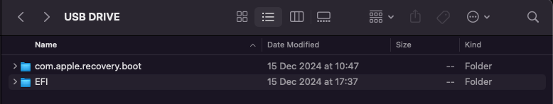
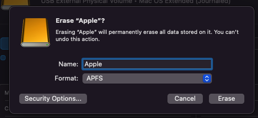

# Information
| Device | Name |
|----------|----------|
| WiFi | RTL8852AE WiFi 6 802.11ax PCIe |
| Ethernet | Realtek PCIe GbE Family Controller - Ethernet 802.3 |
| SSD | NVME 512GB SAMSUNG MZALQ512HBLU-00BL2 |
| iGPU | AMD Radeon Graphics Processor |
| dGPU | NVIDIA RTX 3050 |
| CPU | AMD Ryzen 5 5600H |

# Status
| Feature | Status |
|----------|----------|
| HDMI | ✅  |
| Ethernet (or USB Share network) | ✅  |
| Speaker - Microphone | ✅  |
| Power Management | ✅  |
| Camera | ✅  |
| Brightness | ✅  |
| External Device (Mouse, Keyboard, Monitor) | ✅  |
| iServices | ✅  |
| Fn (Brightness, sound) | ✅ |
| Sleep & Wake| ✅ |
| Touchpad | ✅ |
| Bluetooth | ❌ | (work with USB Orico BT403) 
| WLAN | ❌ |
| dGPU | ❌ |

# Tutorial

## Presiquisites

- Download [EFI](https://drive.google.com/drive/folders/1fFgWZ-1S54pKGRx235hEZsIKSKqVMaPm?usp=sharing)
- At least 16Gb USB (32Gb Recommended)
- macOS Installer (Read open core guides)
- Ethernet capble or can share network over Android phone
- In BIOS (Press F2 to enter BIOS):
    - Turn off Secure Boot, dedicated GPU
    - Change iGPU Memory to 2GB

## Installation

1. Copy macOS Installer & EFI Folder to USB

2. Enter BIOS and set USB to first boot
3. Boot to USB
4. Eraser hard disk with AFPS format

5. Enter MacOS Installer and choose hard disk just eraser above.
    - This take about 30 mins, so please patience.
    - Restarting completely good when installing.
6. When done, configure your macOS
7. Use OpenCore to generate SMBIOS with MacBookPro16,3
8. Restart
9. Done

## Post-Install
Sound Problems:

    1. Download [VoodooHDA Kext](https://sourceforge.net/projects/voodoohda/files/).
    2. Download [Kext-Droplet](https://github.com/chris1111/Kext-Droplet-macOS).
    3. Reboot and boot to USB then choose MacOS Recovery
    4. On Menubar > View > Terminal
    5. Enter command: csrutil disable (Disable SIP)
    6. Reboot
    7. Open Kext-Droplet and drag VoodooHDA Kext to install (Allow when have notification)
    8. Go to System Preferences > Security & Privacy > Tab General > Allow Extension
    9. Reboot

- If using app have use hardware accleration or something like that -> disable it, some common app like: Chrome, Discord, Edge, v.v (App Electron Based).

- If using Docker with AMD CPU, please use through Virtual Box with version < 7 (recommended 6.1) and minikube
# References
- [OpenCore Guide - English](https://dortania.github.io/OpenCore-Install-Guide/)
- [VNO Guide - Vietnamese](https://vnohackintosh.com)
- [Mihot7's EFI](https://github.com/Mihot7/lenovo-ideapad-gaming-3-15ach6-open-core)
    

